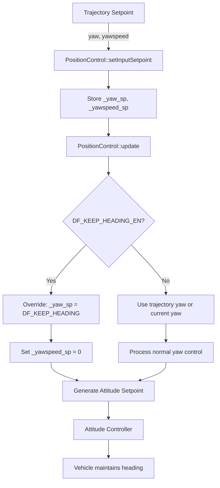
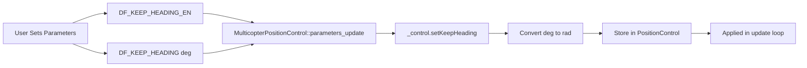

# DF_KEEP_HEADING Feature Implementation Plan

## Overview
This plan outlines the implementation of a heading hold feature for the PX4 position control system. The feature allows the vehicle to maintain a fixed heading (in degrees, 0-360, where 0 is North) when enabled via parameters.

## Parameters to Add

### DF_KEEP_HEADING_EN
- **Type**: Boolean (INT32)
- **Description**: Enable/disable the keep heading feature
- **Default**: 0 (disabled)
- **Group**: Multicopter Position Control

### DF_KEEP_HEADING
- **Type**: Float
- **Description**: Target heading to maintain in degrees (0-360, where 0 is North)
- **Range**: 0.0 to 360.0
- **Default**: 0.0 (North)
- **Unit**: deg
- **Group**: Multicopter Position Control

## Architecture Analysis

### Current Heading Control Flow
1. **Trajectory Setpoint** → Contains `yaw` and `yawspeed` fields
2. **PositionControl::setInputSetpoint()** → Stores `_yaw_sp` and `_yawspeed_sp`
3. **PositionControl::update()** → Processes heading:
   - Line 107-110: Sets `_yawspeed_sp` to 0 if NAN
   - Line 108-110: Sets `_yaw_sp` to current `_yaw` if NAN (disables yaw control)
4. **Output** → `_yaw_sp` used in attitude setpoint generation

### Integration Point
The optimal location to override the heading is in [`PositionControl::update()`](src/modules/mc_pos_control/PositionControl/PositionControl.cpp:100) after the input validation but before the output is generated. This ensures:
- Minimal code changes
- Clean separation of concerns
- Easy to enable/disable via parameter

## Implementation Steps

### 1. Create Parameter Definition File
**File**: `src/modules/mc_pos_control/df_keep_heading_params.c`

```c
/**
 * Enable keep heading feature
 *
 * When enabled, the position controller will maintain the heading
 * specified by DF_KEEP_HEADING parameter instead of following
 * trajectory setpoint yaw commands.
 *
 * @boolean
 * @group Multicopter Position Control
 * @reboot_required false
 */
PARAM_DEFINE_INT32(DF_KEEP_HEADING_EN, 0);

/**
 * Keep heading target angle
 *
 * Target heading in degrees (0-360) where 0 is North.
 * This heading will be maintained when DF_KEEP_HEADING_EN is enabled.
 *
 * @unit deg
 * @min 0.0
 * @max 360.0
 * @decimal 1
 * @increment 1.0
 * @group Multicopter Position Control
 * @reboot_required false
 */
PARAM_DEFINE_FLOAT(DF_KEEP_HEADING, 0.0f);
```

### 2. Modify PositionControl Header
**File**: [`src/modules/mc_pos_control/PositionControl/PositionControl.hpp`](src/modules/mc_pos_control/PositionControl/PositionControl.hpp:1)

**Changes**:
- Add setter method for keep heading parameters (around line 127, after `setHoverThrust()`)

```cpp
/**
 * Set keep heading parameters
 * @param enable Enable/disable keep heading feature
 * @param heading_deg Target heading in degrees (0-360, 0=North)
 */
void setKeepHeading(bool enable, float heading_deg);
```

- Add private member variables (around line 239, after `_yaw`)

```cpp
// Keep heading feature
bool _keep_heading_enabled{false};
float _keep_heading_target{0.0f}; // radians
```

### 3. Modify PositionControl Implementation
**File**: [`src/modules/mc_pos_control/PositionControl/PositionControl.cpp`](src/modules/mc_pos_control/PositionControl/PositionControl.cpp:1)

**Add setter implementation** (after `updateHoverThrust()`, around line 83):

```cpp
void PositionControl::setKeepHeading(bool enable, float heading_deg) {
  _keep_heading_enabled = enable;
  // Convert degrees to radians and normalize to [-pi, pi]
  _keep_heading_target = math::radians(heading_deg);
  _keep_heading_target = wrap_pi(_keep_heading_target);
}
```

**Modify update() method** (around line 107-110):

```cpp
// Apply keep heading override if enabled
if (_keep_heading_enabled) {
  _yaw_sp = _keep_heading_target;
  _yawspeed_sp = 0.0f; // No yaw rate when holding heading
} else {
  _yawspeed_sp = PX4_ISFINITE(_yawspeed_sp) ? _yawspeed_sp : 0.f;
  _yaw_sp = PX4_ISFINITE(_yaw_sp) ? _yaw_sp : _yaw;
}
```

### 4. Modify MulticopterPositionControl
**File**: [`src/modules/mc_pos_control/MulticopterPositionControl.hpp`](src/modules/mc_pos_control/MulticopterPositionControl.hpp:1)

**Add parameter declarations** in the `DEFINE_PARAMETERS` section (around line 197):

```cpp
(ParamInt<px4::params::DF_KEEP_HEADING_EN>) _param_df_keep_heading_en,
(ParamFloat<px4::params::DF_KEEP_HEADING>) _param_df_keep_heading
```

**File**: [`src/modules/mc_pos_control/MulticopterPositionControl.cpp`](src/modules/mc_pos_control/MulticopterPositionControl.cpp:1)

**Update parameters_update() method** (around line 320, at the end of the function):

```cpp
// Set keep heading parameters
_control.setKeepHeading(_param_df_keep_heading_en.get(),
                        _param_df_keep_heading.get());
```

### 5. Update CMakeLists.txt
**File**: `src/modules/mc_pos_control/CMakeLists.txt`

Add the new parameter file to the sources list:

```cmake
df_keep_heading_params.c
```

## Design Rationale

### Why This Approach is Minimal

1. **Single Override Point**: The heading override happens in one place - [`PositionControl::update()`](src/modules/mc_pos_control/PositionControl/PositionControl.cpp:100)

2. **No Control Loop Changes**: The existing yaw control logic remains unchanged. We simply override the setpoint.

3. **Parameter-Driven**: The feature is completely controlled by parameters, no code logic changes needed at runtime.

4. **Clean Separation**: The [`PositionControl`](src/modules/mc_pos_control/PositionControl/PositionControl.hpp:75) class handles the override, while [`MulticopterPositionControl`](src/modules/mc_pos_control/MulticopterPositionControl.hpp:87) only passes parameters.

5. **Backward Compatible**: When disabled (default), the system behaves exactly as before.

### Heading Coordinate System

- **Input**: Degrees (0-360), where 0 = North (NED frame)
- **Internal**: Radians, normalized to [-π, π]
- **Frame**: NED (North-East-Down) - standard PX4 convention

The conversion from degrees to radians and normalization ensures compatibility with PX4's internal heading representation.

## Testing Recommendations

### Unit Testing
1. Test parameter setting and getting
2. Test heading conversion (degrees to radians)
3. Test heading normalization (360° wraps to 0°)
4. Test enable/disable functionality

### Integration Testing
1. **Test 1**: Enable feature, set heading to 0° (North), verify vehicle maintains North heading during position changes
2. **Test 2**: Set heading to 90° (East), verify vehicle maintains East heading
3. **Test 3**: Set heading to 180° (South), verify vehicle maintains South heading
4. **Test 4**: Set heading to 270° (West), verify vehicle maintains West heading
5. **Test 5**: Disable feature, verify normal yaw control resumes
6. **Test 6**: Test heading wrap-around (359° → 1°)

### Flight Testing
1. Enable feature in position mode
2. Command position changes in various directions
3. Verify heading remains constant regardless of movement direction
4. Test with different heading values
5. Verify smooth transition when enabling/disabling feature

## Code Locations Summary

| File | Lines | Purpose |
|------|-------|---------|
| `df_keep_heading_params.c` | New file | Parameter definitions |
| [`PositionControl.hpp`](src/modules/mc_pos_control/PositionControl/PositionControl.hpp:1) | ~127, ~239 | Add setter method and member variables |
| [`PositionControl.cpp`](src/modules/mc_pos_control/PositionControl/PositionControl.cpp:1) | ~83, ~107 | Add setter implementation and override logic |
| [`MulticopterPositionControl.hpp`](src/modules/mc_pos_control/MulticopterPositionControl.hpp:1) | ~197 | Add parameter declarations |
| [`MulticopterPositionControl.cpp`](src/modules/mc_pos_control/MulticopterPositionControl.cpp:1) | ~320 | Call setter with parameter values |
| `CMakeLists.txt` | Sources section | Add new parameter file |

## Mermaid Diagram: Control Flow



## Mermaid Diagram: Parameter Flow



## Implementation Checklist

- [ ] Create `df_keep_heading_params.c` with parameter definitions
- [ ] Add `setKeepHeading()` method declaration to [`PositionControl.hpp`](src/modules/mc_pos_control/PositionControl/PositionControl.hpp:1)
- [ ] Add member variables `_keep_heading_enabled` and `_keep_heading_target` to [`PositionControl.hpp`](src/modules/mc_pos_control/PositionControl/PositionControl.hpp:1)
- [ ] Implement `setKeepHeading()` method in [`PositionControl.cpp`](src/modules/mc_pos_control/PositionControl/PositionControl.cpp:1)
- [ ] Add heading override logic in [`PositionControl::update()`](src/modules/mc_pos_control/PositionControl/PositionControl.cpp:100)
- [ ] Add parameter declarations to [`MulticopterPositionControl.hpp`](src/modules/mc_pos_control/MulticopterPositionControl.hpp:1)
- [ ] Add parameter update call in [`MulticopterPositionControl.cpp`](src/modules/mc_pos_control/MulticopterPositionControl.cpp:1)
- [ ] Update `CMakeLists.txt` to include new parameter file
- [ ] Build and test the implementation
- [ ] Verify parameter appears in QGroundControl
- [ ] Conduct flight tests

## Notes

- The implementation is minimal and focused on the position control module only
- No changes to attitude controller or rate controller needed
- The feature works by overriding the yaw setpoint before it reaches the attitude controller
- When disabled, the system behaves identically to the original implementation
- The heading is specified in degrees for user convenience but stored internally in radians
- The wrap_pi() function ensures proper handling of angle wraparound
