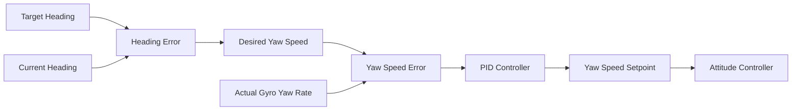

# Yaw Speed PID Controller Implementation Plan

## Overview
Implement a full PID controller for yaw speed control based on heading error and actual gyro yaw rate. This replaces the current simple proportional controller in the `_keep_heading_enabled` logic.

## New Parameters

This implementation adds **4 new configurable parameters**:

1. **DF_YAWSPEED_MAXRATE** (90.0 deg/s) - Maximum desired yaw rate for keep heading
   - Replaces hardcoded 90 deg/s limit in current implementation
   - Range: 10-180 deg/s
   - Allows tuning rotation speed for different mission requirements

2. **DF_YAWSPEED_P** (1.0) - Proportional gain for yaw speed PID control
   - Controls response speed to yaw rate errors
   - Range: 0.0-5.0

3. **DF_YAWSPEED_I** (0.1) - Integral gain for yaw speed PID control
   - Eliminates steady-state heading errors
   - Range: 0.0-2.0

4. **DF_YAWSPEED_D** (0.05) - Derivative gain for yaw speed PID control
   - Dampens oscillations and improves stability
   - Range: 0.0-1.0

## Current Implementation Analysis

### Location
- **File**: [`src/modules/mc_pos_control/PositionControl/PositionControl.cpp`](../src/modules/mc_pos_control/PositionControl/PositionControl.cpp:116-142)
- **Method**: `PositionControl::update()`
- **Lines**: 116-142

### Current Logic
```cpp
if (_keep_heading_enabled) {
    _yaw_sp = _keep_heading_target;

    // Calculate heading error
    float heading_error = _keep_heading_target - _yaw;
    heading_error = wrap_pi(heading_error);

    // Simple P controller
    const float yaw_p_gain = 0.10f;
    _yawspeed_sp = yaw_p_gain * heading_error;

    // Min rate logic and rate limiting...
}
```

**Issues with Current Approach:**
- Only proportional control - no integral term to eliminate steady-state error
- No derivative term to dampen oscillations
- Hardcoded gain value (0.10f)
- No feedback from actual gyro yaw rate

## Proposed PID Controller Design

### Control Loop Architecture



### PID Formula
```
yaw_speed_setpoint = P * error + I * integral + D * derivative

where:
  error = desired_yaw_speed - actual_gyro_yaw_rate
  desired_yaw_speed = heading_error * heading_to_rate_gain
  integral += error * dt (with anti-windup)
  derivative = (error - previous_error) / dt
```

### Two-Stage Control
1. **Outer Loop**: Heading error → Desired yaw speed (P controller)
2. **Inner Loop**: Yaw speed error → Yaw speed setpoint (PID controller)

## Implementation Details

### 1. Parameter Definitions

**File**: [`src/modules/mc_pos_control/multicopter_keep_heading_params.c`](../src/modules/mc_pos_control/multicopter_keep_heading_params.c)

Add four new parameters:

```c
/**
 * Maximum desired yaw rate for keep heading
 *
 * Maximum yaw rate setpoint when keep heading is enabled.
 * This limits the commanded rotation speed during heading corrections.
 * Higher values allow faster heading corrections but may cause oscillations.
 * Lower values provide smoother rotation but slower heading acquisition.
 *
 * @unit deg/s
 * @min 10.0
 * @max 180.0
 * @decimal 1
 * @increment 5.0
 * @group Multicopter Position Control
 */
PARAM_DEFINE_FLOAT(DF_YAWSPEED_MAXRATE, 90.0f);

/**
 * Yaw speed proportional gain
 *
 * Proportional gain for yaw speed control when keep heading is enabled.
 * Higher values result in faster response to yaw rate errors.
 *
 * @min 0.0
 * @max 5.0
 * @decimal 2
 * @increment 0.05
 * @group Multicopter Position Control
 */
PARAM_DEFINE_FLOAT(DF_YAWSPEED_P, 1.0f);

/**
 * Yaw speed integral gain
 *
 * Integral gain for yaw speed control when keep heading is enabled.
 * Eliminates steady-state errors in yaw rate tracking.
 *
 * @min 0.0
 * @max 2.0
 * @decimal 2
 * @increment 0.01
 * @group Multicopter Position Control
 */
PARAM_DEFINE_FLOAT(DF_YAWSPEED_I, 0.1f);

/**
 * Yaw speed derivative gain
 *
 * Derivative gain for yaw speed control when keep heading is enabled.
 * Dampens oscillations and improves stability.
 *
 * @min 0.0
 * @max 1.0
 * @decimal 3
 * @increment 0.005
 * @group Multicopter Position Control
 */
PARAM_DEFINE_FLOAT(DF_YAWSPEED_D, 0.05f);
```

### 2. Data Structure Updates

**File**: [`src/modules/mc_pos_control/PositionControl/PositionControl.hpp`](../src/modules/mc_pos_control/PositionControl/PositionControl.hpp:48-53)

Update `PositionControlStates` struct:

```cpp
struct PositionControlStates {
    matrix::Vector3f position;
    matrix::Vector3f velocity;
    matrix::Vector3f acceleration;
    float yaw;
    float yaw_rate;  // NEW: Gyro yaw rate (rad/s)
};
```

### 3. PositionControl Class Updates

**File**: [`src/modules/mc_pos_control/PositionControl/PositionControl.hpp`](../src/modules/mc_pos_control/PositionControl/PositionControl.hpp)

#### Add Public Methods
```cpp
/**
 * Set the yaw speed PID gains
 * @param P proportional gain
 * @param I integral gain
 * @param D derivative gain
 */
void setYawSpeedGains(float P, float I, float D);

/**
 * Set maximum yaw rate for keep heading
 * @param max_yaw_rate_deg_s Maximum yaw rate in degrees per second
 */
void setMaxYawRate(float max_yaw_rate_deg_s);
```

#### Add Private Members
```cpp
// Yaw speed PID gains
float _gain_yawspeed_p{1.0f};
float _gain_yawspeed_i{0.1f};
float _gain_yawspeed_d{0.05f};

// Yaw speed PID state
float _yawspeed_error_prev{0.0f};
float _yawspeed_integral{0.0f};
float _yaw_rate{0.0f};  // Current gyro yaw rate

// Maximum yaw rate limit
float _max_yaw_rate{math::radians(90.0f)};  // Maximum yaw rate in rad/s
```

### 4. PositionControl Implementation

**File**: [`src/modules/mc_pos_control/PositionControl/PositionControl.cpp`](../src/modules/mc_pos_control/PositionControl/PositionControl.cpp)

#### Add Setter Methods
```cpp
void PositionControl::setYawSpeedGains(float P, float I, float D) {
    _gain_yawspeed_p = P;
    _gain_yawspeed_i = I;
    _gain_yawspeed_d = D;
}

void PositionControl::setMaxYawRate(float max_yaw_rate_deg_s) {
    _max_yaw_rate = math::radians(max_yaw_rate_deg_s);
}
```

#### Update setState Method
```cpp
void PositionControl::setState(const PositionControlStates &states) {
    _pos = states.position;
    _vel = states.velocity;
    _yaw = states.yaw;
    _vel_dot = states.acceleration;
    _yaw_rate = states.yaw_rate;  // NEW
}
```

#### Replace Keep Heading Logic in update()

**Location**: Lines 116-142

```cpp
if (_keep_heading_enabled) {
    _yaw_sp = _keep_heading_target;

    // Outer loop: Heading error to desired yaw speed
    float heading_error = _keep_heading_target - _yaw;
    heading_error = wrap_pi(heading_error);

    // Proportional gain for heading to yaw speed conversion
    const float heading_p_gain = 2.0f;  // rad/s per rad of error
    float desired_yaw_speed = heading_p_gain * heading_error;

    // Limit desired yaw speed using configurable parameter
    desired_yaw_speed = math::constrain(desired_yaw_speed,
                                       -_max_yaw_rate,
                                       _max_yaw_rate);

    // Inner loop: PID control on yaw speed error
    float yawspeed_error = desired_yaw_speed - _yaw_rate;

    // Proportional term
    float yawspeed_p = _gain_yawspeed_p * yawspeed_error;

    // Integral term with anti-windup
    _yawspeed_integral += yawspeed_error * dt;

    // Anti-windup: limit integral
    const float integral_limit = math::radians(45.0f);  // 45 deg/s max from integral
    _yawspeed_integral = math::constrain(_yawspeed_integral,
                                        -integral_limit / _gain_yawspeed_i,
                                        integral_limit / _gain_yawspeed_i);

    float yawspeed_i = _gain_yawspeed_i * _yawspeed_integral;

    // Derivative term
    float yawspeed_d = _gain_yawspeed_d * (yawspeed_error - _yawspeed_error_prev) / dt;
    _yawspeed_error_prev = yawspeed_error;

    // Combine PID terms
    _yawspeed_sp = yawspeed_p + yawspeed_i + yawspeed_d;

    // Final rate limiting using configurable parameter
    _yawspeed_sp = math::constrain(_yawspeed_sp, -_max_yaw_rate, _max_yaw_rate);

    // Reset integral when heading error is very small (achieved target)
    if (fabsf(heading_error) < math::radians(1.0f)) {
        _yawspeed_integral *= 0.95f;  // Slowly decay integral near target
    }

} else {
    // Reset PID state when not in keep heading mode
    _yawspeed_integral = 0.0f;
    _yawspeed_error_prev = 0.0f;

    _yawspeed_sp = PX4_ISFINITE(_yawspeed_sp) ? _yawspeed_sp : 0.f;
    _yaw_sp = PX4_ISFINITE(_yaw_sp) ? _yaw_sp : _yaw;
}
```

### 5. MulticopterPositionControl Updates

**File**: [`src/modules/mc_pos_control/MulticopterPositionControl.cpp`](../src/modules/mc_pos_control/MulticopterPositionControl.cpp)

#### Update set_vehicle_states()

**Location**: Lines 327-400

Add after line 397:
```cpp
states.yaw = vehicle_local_position.heading;
states.yaw_rate = vehicle_local_position.heading_rate;  // NEW: Get gyro yaw rate
```

#### Add Parameter Declarations

**File**: [`src/modules/mc_pos_control/MulticopterPositionControl.hpp`](../src/modules/mc_pos_control/MulticopterPositionControl.hpp)

Add to parameter list:
```cpp
DEFINE_PARAMETERS(
    // ... existing parameters ...
    (ParamFloat<px4::params::DF_YAWSPEED_MAXRATE>) _param_df_yawspeed_maxrate,
    (ParamFloat<px4::params::DF_YAWSPEED_P>) _param_df_yawspeed_p,
    (ParamFloat<px4::params::DF_YAWSPEED_I>) _param_df_yawspeed_i,
    (ParamFloat<px4::params::DF_YAWSPEED_D>) _param_df_yawspeed_d
)
```

#### Load and Apply Parameters

**Location**: In `parameters_update()` method

Add after keep heading parameters are loaded:
```cpp
// Set maximum yaw rate
_control.setMaxYawRate(_param_df_yawspeed_maxrate.get());

// Set yaw speed PID gains
_control.setYawSpeedGains(
    _param_df_yawspeed_p.get(),
    _param_df_yawspeed_i.get(),
    _param_df_yawspeed_d.get()
);
```

## Benefits of This Approach

### 1. **Improved Accuracy**
- Integral term eliminates steady-state heading errors
- Actual gyro feedback ensures accurate rate tracking

### 2. **Better Stability**
- Derivative term dampens oscillations
- Two-stage control separates heading and rate control

### 3. **Tunable Performance**
- Parameters allow field tuning for different vehicle dynamics
- Can optimize for speed vs. smoothness

### 4. **Robust Control**
- Anti-windup prevents integral saturation
- Rate limiting prevents excessive commands
- Graceful degradation when exiting keep heading mode

## Tuning Guidelines

### Initial Values
- **DF_YAWSPEED_P**: 1.0 - Start with moderate response
- **DF_YAWSPEED_I**: 0.1 - Small integral to eliminate drift
- **DF_YAWSPEED_D**: 0.05 - Light damping

### Tuning Process
1. **P Gain**: Increase until response is quick but starts to oscillate
2. **D Gain**: Increase to dampen oscillations
3. **I Gain**: Increase slowly to eliminate steady-state error

### Expected Behavior
- **Low P**: Slow, sluggish heading corrections
- **High P**: Fast but oscillatory response
- **Low I**: Persistent heading offset
- **High I**: Overshoot and instability
- **Low D**: Oscillations, ringing
- **High D**: Noise amplification, jittery motion

## Testing Strategy

### 1. Unit Testing
- Test PID calculations with known inputs
- Verify anti-windup behavior
- Check state reset when disabling

### 2. SITL Testing
- Test heading hold in simulation
- Verify smooth transitions
- Check parameter sensitivity

### 3. Flight Testing
- Start with conservative gains
- Test in calm conditions first
- Monitor for oscillations
- Verify heading accuracy

## Migration Notes

### Backward Compatibility
- New parameters have sensible defaults
- Existing behavior preserved when parameters at default
- No breaking changes to external interfaces

### Performance Impact
- Minimal computational overhead (few floating-point operations)
- No additional memory allocations
- Same update rate as existing controller

## Files Modified Summary

1. **multicopter_keep_heading_params.c** - Add 4 new parameters (DF_YAWSPEED_MAXRATE, DF_YAWSPEED_P, DF_YAWSPEED_I, DF_YAWSPEED_D)
2. **PositionControl.hpp** - Update struct and class definition, add setter methods and member variables
3. **PositionControl.cpp** - Implement PID logic and setter methods
4. **MulticopterPositionControl.hpp** - Add parameter declarations
5. **MulticopterPositionControl.cpp** - Load parameters and pass gyro data

## Conclusion

This implementation provides a robust, tunable PID controller for yaw speed that:
- Uses actual gyro feedback for accurate control
- Eliminates steady-state heading errors with integral term
- Dampens oscillations with derivative term
- Maintains stability with anti-windup and rate limiting
- Allows field tuning through parameters

The two-stage control architecture (heading → desired rate → actual rate) follows best practices for cascaded control systems and provides better performance than a single-stage controller.
